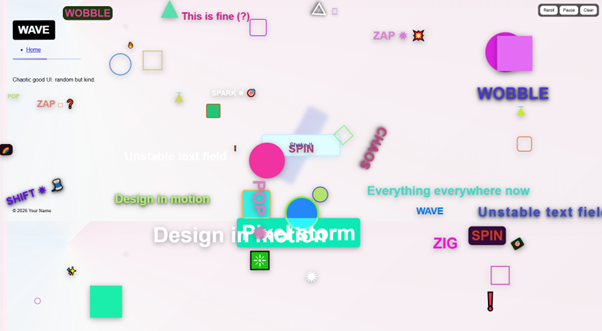
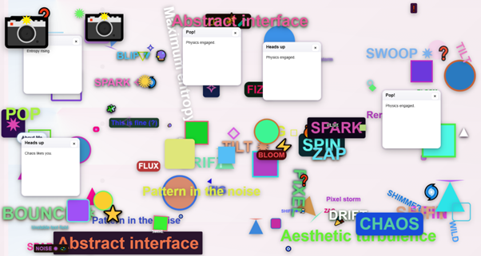
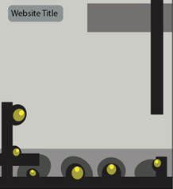
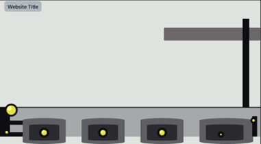
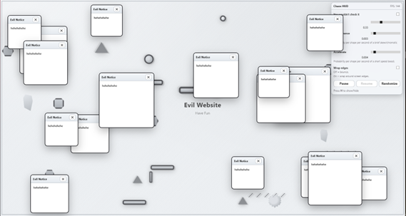
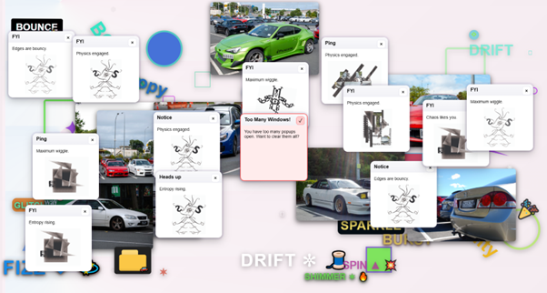

# About Me
Portfolio Website – Orlando
My design intention was to create a bizarre, chaotic website that users must navigate through to find previous projects I’ve done. Within the chaos, random pop-ups appear displaying my work, while my ‘About Me’ page floats around the website clicking on it will take you to a formal page about myself.

### **AI Use**
AI was used to create the code structure for the website, as well as to help troubleshoot problems that came up. I used Microsoft Copilot as my AI assistant. I would describe what I wanted on my website though prompts and Copilot would generate code and help implement it without breaking anything.

### Can This Website Work on Mobile?
No. Unfortunately, this website is not compatible with mobile devices. There are too many elements that are not properly optimised for a phone to handle.

### Inspiration
I took inspiration from 90s computer virus pop-ups and Tetrageddon games, which have chaotic and visually overwhelming displays.
https://tetrageddon.com/

# Progress
**26.02.26** – My idea wasn’t clear yet, but I knew I wanted to make something messy. As it was my first time using Microsoft Copilot, I started giving lots of prompts describing chaotic ideas. One concept stood out too me. Static, randomly coloured shapes, words and emojis that spawn every time you reload the page or click a button in the middle.

**05.03.26** – I wasn’t sure what to do next, so I started creating a design look to the website. I wanted a darker theme, so I created a layout in Adobe Illustrator and used Microsoft Copilot to turn it into code. The result wasn’t what I wanted. Instead, I ended up with a metallic grey theme combined with random shapes.

**12.03.26** – I wanted to add functionality, so I used Copilot to generate code that made shapes move and bounce off edges. I also added a pop-up system with a random chance to spawn every 8–18 seconds. This version wasn’t perfect, only the top of the pop-ups could be dragged, and they would disappear when released.
I also added a “chaos HUD” to pause/randomise shape speed, glitch effects, accelerate movement, and toggle bouncing edges. At this point, I wasn’t happy with the design, so I scrapped this version and returned to the colourful randomness from the start. However, I now had a clearer idea of the functions I wanted. I made shapes and words move at random speeds (without acceleration, as it the shapes would move too fast over time).

**17.03.26** – With a clearer direction, I added an “About Me” button that floats around the website. Clicking it takes you to a formal page, with a back button to return to the chaos.
Words and shapes now randomly spawn, move, spin, bounce, and fade away over time. After 10 pop-ups, a red pop-up appears giving the option to remove all of them.
I also added a camera emoji that randomly spawns when clicked, it flashes and shows photography of cars I’ve taken before, then disappears. I briefly added a rare jump scare but later removed it.
At this point, I learned that giving detailed prompts to Microsoft Copilot is very important to get the results I want. However, I find it difficult to fully explain my ideas, so I often get something close and then edit the code myself or give additional prompts to refine it.

**23.03.26** - I reworked the camera system. Now it spawns a folder with a car icon, which releases a random number of car photos that move around the website.
I also added Adobe Illustrator work into the random pop-ups and introduced animations for everything:
-  	Car photos sink like a black hole when clicked 
-  	Illustrator works rotate, move side to side, hover, and fade in/out 
- 	Clicking the title triggers confetti 
- 	Pop-ups can glitch, implode, sink, or spin when removed 
- 	Words and shapes shatter into pieces when clicked
There were more ideas I wanted to add, such as:
- 	Making the “About Me” page show in the main page
- 	Adding fake sale prompts 
- 	Combining pop-ups together

However, due to time constraints, I couldn’t include them. At this stage, I’ve noticed my JavaScript file has become very large, making it difficult to add new features, as certain code must be placed in specific orders to avoid breaking the website. Also, when testing the website on GitHub versus Visual Studio Code Live Server, it became very laggy. To fix this, I reduced the amount of chaos that can appear at once.
